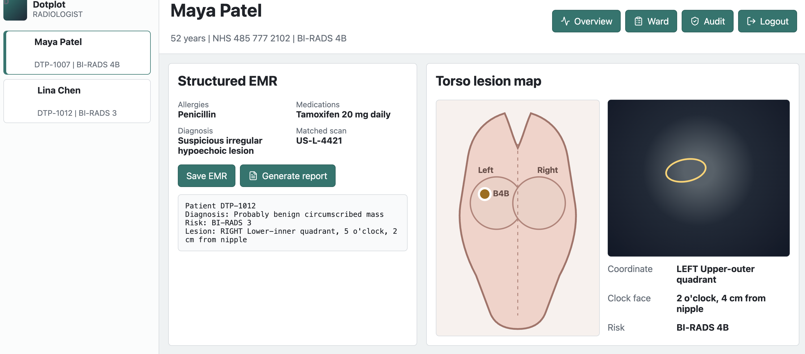

# Dotplot

Dotplot is a full-stack PACS-EMR integration prototype for breast cancer case review. It brings patient records, ultrasound study metadata, lesion coordinates, breast torso visualisation, role-based workflows, audit logging, and report generation into a single clinical workspace.

The project is built using synthetic data only and demonstrates the development of secure healthcare software systems, clinical data management workflows, and full-stack web application architecture.


## Application Preview


## Features

## Why This Project?

Radiologists and nurses often move between disconnected systems, such as electronic medical records (EMRs), PACS imaging platforms, and external documentation. Dotplot explores how a unified browser-based clinical workspace could reduce context switching while maintaining the security and auditability expected in healthcare software.

## Key Skills Demonstrated

* Full-Stack Development
* React & TypeScript
* Node.js & Fastify
* REST API Development
* Database Design with Prisma
* Authentication & Authorisation
* Role-Based Access Control (RBAC)
* Audit Logging & Security
* Healthcare Data Management
* System Design


### Clinical Workspace

Clinicians can view structured patient details, matched ultrasound scan IDs, diagnosis information, BI-RADS ratings, allergies, medications, and lesion metadata from a single interface.

### Patient Management

* Patient CRUD operations through a backend API
* Patient-to-ultrasound study matching
* Structured clinical record management

### Lesion Mapping

Radiologists can review lesion side, quadrant, clock-face position, distance from nipple, and associated scan information through an interactive torso visualisation.

### Role-Based Access Control

Different user roles are supported:

* **Radiologist** – Patient review and report generation
* **Nurse** – Clinical observation workflow
* **IT Administrator** – Audit trail review and system administration

### Audit Logging

Clinical actions are recorded server-side with user, role, patient ID, action type, and timestamp information to support traceability and accountability.

### Security Features

* JWT Authentication
* bcrypt Password Hashing
* Server-side Validation with Zod
* Role-Based Access Control
* No Protected Health Information (PHI) in URLs
* Append-Only Audit Events

## Technology Stack

| Area           | Technologies                            |
| -------------- | --------------------------------------- |
| Frontend       | React, TypeScript, Vite, TanStack Query |
| Backend        | Node.js, Fastify, TypeScript, Zod       |
| Database       | Prisma, SQLite                          |
| Authentication | JWT, bcrypt                             |
| DevOps         | Docker Compose, GitHub Actions          |
| Testing        | Vitest                                  |

## Architecture

* `apps/web` – React and TypeScript frontend
* `apps/api` – Fastify API, Prisma schema, authentication, RBAC, and audit logging
* `packages/shared` – Shared TypeScript domain models and types

## Development

The project can be run locally using Node.js or Docker.

### Local Development

```bash
npm install
cp apps/api/.env.example apps/api/.env
npm run db:push
npm run db:seed
npm run dev
```

### Docker

```bash
docker compose up --build
```

## Data Notice

All patient names, identifiers, scan IDs, and clinical details used within this project are synthetic mock data.

This repository is intended for educational and portfolio purposes only and must not be used with real patient data or protected health information (PHI).

## Author

Zainab Khan

Final-Year Computing Student | Software Development & Health Technology Projects
